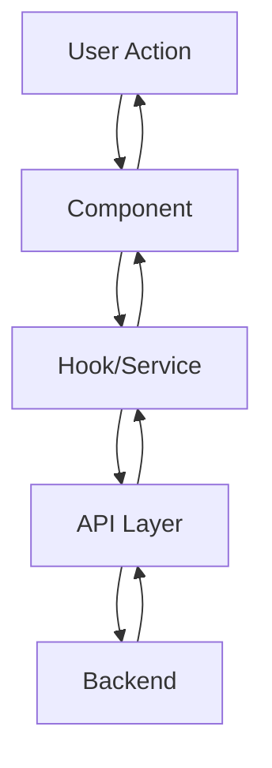

# Kế

hoạch Cải thiện Templates PAPER-CODE

## Mục tiêu

Cải thiện toàn diện các file template Jinja2 trong `src/templates/` để đảm bảo tính ổn định, nhất quán, đầy đủ và tuân thủ các thực hành hiện đại.

## Phân tích hiện trạng

### Cấu trúc thư mục

- `core/`: 9 files (README, LICENSE, CONTRIBUTING, TESTING, DEPLOYMENT, SECURITY, CHANGELOG, gitignore)
- `ai/`: 5 files (AI_RULES, AI_CONTEXT, AI_WORKFLOWS, copilot-instructions, cursorrules)
- `github/`: 2 files (ci.yml, PULL_REQUEST_TEMPLATE)
- `libs/`: 35 files (các thư viện như React Router, TailwindCSS, Zod, etc.)
- `stacks/`: 48 files (architecture và standards cho các stack khác nhau)

### Vấn đề đã phát hiện

1. **Xử lý lỗi yếu**: Chỉ 3/100+ templates sử dụng `| default()` filter, dễ gây lỗi khi biến thiếu
2. **Thiếu nhất quán**: Formatting và cấu trúc khác nhau giữa các template
3. **Thông tin chưa đầy đủ**: Một số template thiếu ví dụ, best practices, hoặc giải thích chi tiết
4. **Có thể lỗi thời**: Một số template có thể tham chiếu API/pattern đã deprecated

## Kế hoạch thực hiện

### Phase 1: Xử lý lỗi và tính ổn định (Error Handling & Robustness)

#### 1.1 Thêm default filters cho tất cả biến quan trọng

**Files cần sửa:**

- `src/templates/core/README.md.j2`: Đã có một số default, cần kiểm tra thêm
- `src/templates/ai/AI_CONTEXT.md.j2`: Thêm default cho `project_type`, `libraries`
- `src/templates/ai/cursorrules.j2`: Thêm default cho `description`, `libraries`
- `src/templates/github/ci.yml.j2`: Thêm fallback cho các điều kiện tech_stack
- Tất cả files trong `stacks/`: Đảm bảo `libraries` có default là `[]`
- Tất cả files trong `libs/`: Kiểm tra điều kiện `tech_stack` có fallback

**Chiến lược:**

```jinja2
# Thay vì:
{{ tech_stack }}

# Sử dụng:
{{ tech_stack | default("Unknown Stack") }}

# Hoặc cho arrays:

```


#### 1.2 Xử lý edge cases trong điều kiện

**Files cần sửa:**

- Tất cả files có nested `` statements
- Đặc biệt: `src/templates/stacks/backend/nodejs_arch.md.j2` (dòng 85 có logic phức tạp)

**Ví dụ cải thiện:**

```jinja2
# Trước:

- We use **{{ libraries | select("in", ["Prisma", "TypeORM"]) | first }}**

# Sau:

- We use **{{ libraries | select("in", ["Prisma", "TypeORM"]) | first | default("ORM") }}**
```


### Phase 2: Tính nhất quán (Consistency)

#### 2.1 Chuẩn hóa cấu trúc markdown

**Tiêu chuẩn áp dụng:**

- Header levels: H1 cho title, H2 cho sections chính, H3 cho subsections
- Emoji usage: Sử dụng nhất quán (📦 cho Installation, 🛠️ cho Configuration, 💻 cho Usage, 🚫 cho Anti-patterns)
- Code blocks: Luôn có language identifier
- Spacing: 1 dòng trống giữa sections

**Files cần chuẩn hóa:**

- Tất cả files trong `libs/`: Đảm bảo cấu trúc giống nhau
- `src/templates/core/TESTING.md.j2`: Thêm emoji và cải thiện formatting
- `src/templates/core/DEPLOYMENT.md.j2`: Chuẩn hóa cấu trúc

#### 2.2 Chuẩn hóa naming conventions trong templates

**Quy tắc:**

- Biến Jinja2: `snake_case` (đã đúng)
- Section headers: Consistent emoji + title format
- Code examples: Luôn có comment giải thích

#### 2.3 Chuẩn hóa code examples

**Tiêu chuẩn:**

- Mỗi code block phải có context comment
- Good/Bad examples phải rõ ràng với ✅/❌ markers
- TypeScript examples phải có type annotations đầy đủ
- Python examples phải có type hints

### Phase 3: Tính đầy đủ (Completeness)

#### 3.1 Bổ sung thông tin thiếu trong core templates

**Files cần cải thiện:`src/templates/core/TESTING.md.j2`:**

- Thêm section về test coverage
- Thêm ví dụ cụ thể cho từng framework
- Thêm section về mocking strategies
- Thêm best practices cho E2E testing

**`src/templates/core/DEPLOYMENT.md.j2`:**

- Thêm section về environment variables
- Thêm Docker examples chi tiết hơn
- Thêm section về rollback strategies
- Thêm monitoring và logging setup

**`src/templates/core/SECURITY.md.j2`:**

- Cần đọc và đánh giá nội dung hiện tại
- Bổ sung OWASP Top 10 references nếu thiếu
- Thêm security best practices cho từng stack

**`src/templates/core/CONTRIBUTING.md.j2`:**

- Thêm section về code review process
- Thêm guidelines cho commit messages chi tiết hơn
- Thêm section về local development setup

#### 3.2 Bổ sung library documentation

**Files cần kiểm tra và bổ sung:**

- Tất cả files trong `libs/` cần có đầy đủ:
- Installation instructions
- Basic usage examples
- Advanced patterns
- Integration với các libraries khác
- Common pitfalls và anti-patterns

**Ưu tiên cao:**

- `src/templates/libs/axios.md.j2`: Thêm error handling patterns
- `src/templates/libs/tanstack_query.md.j2`: Kiểm tra có đủ examples không
- `src/templates/libs/redux_toolkit.md.j2`: Đảm bảo có RTK Query examples nếu cần

#### 3.3 Bổ sung stack architecture docs

**Files cần cải thiện:**

- Tất cả `*_arch.md.j2` files cần có:
- Visual diagrams (mermaid) cho data flow
- Folder structure examples chi tiết hơn
- Dependency injection patterns (nếu áp dụng)
- Error handling architecture

**Ví dụ cải thiện cho `src/templates/stacks/frontend/react_arch.md.j2`:**

- Thêm mermaid diagram cho component hierarchy
- Thêm section về performance optimization
- Thêm section về code splitting strategies

### Phase 4: Cập nhật thực hành hiện đại (Modern Practices)

#### 4.1 Loại bỏ deprecated APIs

**Cần kiểm tra và cập nhật:React/Next.js templates:**

- Đảm bảo không có references đến Class Components
- Kiểm tra React Router v6 syntax (không dùng `useHistory`, `<Switch>`)
- Đảm bảo sử dụng modern hooks patterns

**FastAPI templates:**

- Đảm bảo sử dụng Pydantic v2 syntax (đã có trong `fastapi_standards.md.j2`)
- Kiểm tra SQLAlchemy 2.0 syntax (đã có)
- Đảm bảo không có `app.on_event` deprecated patterns

**Node.js templates:**

- Đảm bảo sử dụng ES Modules (`import/export`)
- Kiểm tra Express async error handling patterns

#### 4.2 Cập nhật version numbers và recommendations

**Files cần cập nhật:**

- `src/templates/github/ci.yml.j2`: 
- Node.js version: Cập nhật lên 20.x hoặc 22.x LTS
- Python version: Cập nhật lên 3.11 hoặc 3.12
- Go version: Cập nhật lên 1.22+
- `src/templates/core/README.md.j2`: Cập nhật version requirements

#### 4.3 Thêm modern patterns

**Cần bổ sung:**

- Server Components patterns cho Next.js (nếu chưa có)
- React Server Actions (React 19+)
- Streaming và Suspense patterns
- Modern error boundaries patterns

### Phase 5: Chất lượng tài liệu (Documentation Quality)

#### 5.1 Cải thiện clarity và readability

**Chiến lược:**

- Thêm "Why" explanations, không chỉ "How"
- Sử dụng analogies cho các concepts phức tạp
- Thêm "When to use" vs "When not to use" sections

#### 5.2 Cải thiện code examples

**Tiêu chuẩn:**

- Mỗi example phải có context comment giải thích
- Examples phải là complete, runnable code (không có `// ...`)
- Thêm "Before/After" comparisons cho refactoring examples

#### 5.3 Thêm troubleshooting sections

**Files cần thêm:**

- Tất cả `libs/*.md.j2`: Thêm "Common Issues" section
- `src/templates/core/DEPLOYMENT.md.j2`: Thêm troubleshooting
- `src/templates/core/TESTING.md.j2`: Thêm debugging tips

#### 5.4 Thêm visual aids

**Sử dụng Mermaid diagrams:**

- Architecture diagrams cho `*_arch.md.j2` files
- Data flow diagrams cho complex patterns
- Sequence diagrams cho authentication flows

**Ví dụ cho `src/templates/stacks/frontend/react_arch.md.j2`:**




## Thứ tự ưu tiên thực hiện

### Priority 1 (Critical - Làm trước)

1. Phase 1: Xử lý lỗi và tính ổn định

- Thêm default filters cho tất cả biến quan trọng
- Fix edge cases trong điều kiện

### Priority 2 (High - Làm tiếp theo)

2. Phase 2: Tính nhất quán

- Chuẩn hóa cấu trúc markdown
- Chuẩn hóa code examples

### Priority 3 (Medium - Làm sau)

3. Phase 4: Cập nhật thực hành hiện đại

- Loại bỏ deprecated APIs
- Cập nhật version numbers

4. Phase 3: Tính đầy đủ

- Bổ sung thông tin thiếu
- Thêm examples và best practices

### Priority 4 (Nice to have)

5. Phase 5: Chất lượng tài liệu

- Cải thiện clarity
- Thêm visual aids

## Files cụ thể cần sửa (Top 20)

1. `src/templates/core/README.md.j2` - Thêm default filters
2. `src/templates/ai/AI_CONTEXT.md.j2` - Thêm default, cải thiện structure
3. `src/templates/ai/cursorrules.j2` - Thêm default filters
4. `src/templates/github/ci.yml.j2` - Cập nhật versions, thêm fallbacks
5. `src/templates/core/TESTING.md.j2` - Bổ sung examples và best practices
6. `src/templates/core/DEPLOYMENT.md.j2` - Bổ sung chi tiết và troubleshooting
7. `src/templates/stacks/backend/nodejs_arch.md.j2` - Fix complex condition logic
8. `src/templates/stacks/frontend/react_arch.md.j2` - Thêm diagrams, cải thiện examples
9. `src/templates/stacks/backend/fastapi_standards.md.j2` - Đã tốt, chỉ cần review
10. `src/templates/libs/react_router.md.j2` - Đã tốt, chỉ cần review
11. `src/templates/libs/tailwindcss.md.j2` - Đã tốt, chỉ cần review
12. `src/templates/libs/zod.md.j2` - Đã tốt, chỉ cần review
13. Tất cả files trong `libs/` - Audit và chuẩn hóa structure
14. Tất cả `*_arch.md.j2` files - Thêm mermaid diagrams
15. Tất cả `*_standards.md.j2` files - Chuẩn hóa formatting
16. `src/templates/core/SECURITY.md.j2` - Đọc và đánh giá, bổ sung nếu cần
17. `src/templates/core/CONTRIBUTING.md.j2` - Bổ sung guidelines
18. `src/templates/github/PULL_REQUEST_TEMPLATE.md.j2` - Cải thiện structure
19. `src/templates/ai/AI_WORKFLOWS.md.j2` - Đọc và đánh giá
20. `src/templates/ai/copilot-instructions.md.j2` - Đọc và đánh giá

## Testing strategy

Sau mỗi phase, cần:

1. Test render với các context khác nhau (có/không có libraries, các tech_stack khác nhau)
2. Validate markdown syntax
3. Kiểm tra các biến Jinja2 có được xử lý đúng không
4. Test edge cases (empty arrays, missing variables, etc.)

## Metrics để đánh giá

- **Error rate**: Giảm số lỗi khi render với context không đầy đủ
- **Consistency score**: % templates tuân thủ formatting standards
- **Completeness score**: % templates có đầy đủ sections cần thiết
- **Modern practices**: % templates không có deprecated patterns

## Lưu ý kỹ thuật

1. **Jinja2 filters**: Sử dụng `default()`, `select()`, `list`, `length` một cách cẩn thận
2. **Conditional logic**: Tránh nested conditions quá sâu, sử dụng `` khi có thể
3. **Markdown trong Jinja2**: Sử dụng `` khi cần render literal Jinja2 syntax trong code examples
4. **Cross-references**: Đảm bảo các links giữa documents là tương đối và đúng format

## Timeline ước tính

- Phase 1: 2-3 giờ
- Phase 2: 3-4 giờ  
- Phase 3: 4-5 giờ